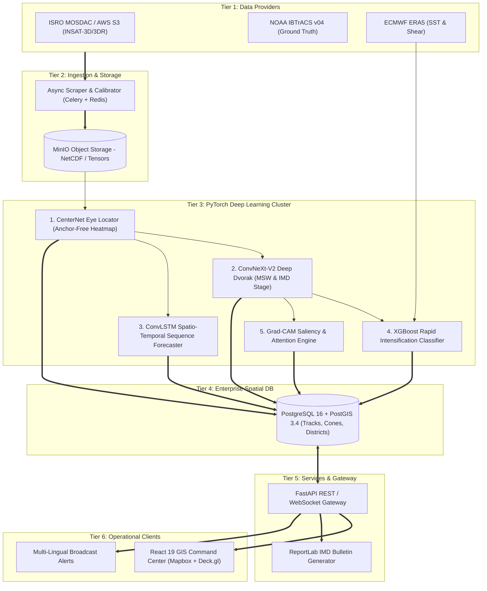
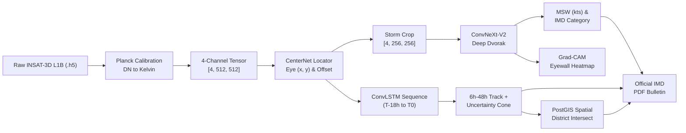

# 03 PRD: Product Requirements Document

## Product Goal

Provide operational meteorologists, disaster management authorities, and maritime planners with an AI-powered satellite intelligence system that automates tropical cyclone identification, classification, trajectory forecasting, and district-level risk assessment with scientific explainability and zero operational delay.

---

## Features

- **Multi-Source Satellite Data Ingestion Engine:** Automated raster processing pipeline converting raw NetCDF/HDF5 radiances into normalized, analysis-ready spatio-temporal tensor cubes.
- **Anchor-Free Circulation Center Locator:** Deep keypoint network (CenterNet) outputting exact coordinates for storm centers without using rigid boxes.
- **Multi-Channel Deep Dvorak Intensity Network:** Residual convolutional backbone (ConvNeXt-V2) estimating sustained winds, central pressure, and IMD storm stages.
- **Recurrent Spatio-Temporal Trajectory Engine:** ConvLSTM forecaster projecting multi-step track paths and bounding uncertainty cones.
- **Environmental Rapid Intensification (RI) Predictor:** Multi-modal gradient booster combining thermal cloud features with sea surface temperature and vertical wind shear.
- **Asymmetric Quadrant Wind Radii Estimator:** Directional radius computation for 34, 50, and 64-knot gale thresholds in all four quadrants.
- **District-Level Population & Inundation Risk Engine:** Geospatial intersection of track cones with coastal elevation and census demographics.
- **Grad-CAM Attention Diagnostics ("Doctor Mode"):** Interactive layer revealing thermal eye-eyewall temperature contrasts driving model outputs.
- **Historical Storm Analog Finder:** Pattern-matching engine surfacing top-3 historical Indian Ocean cyclones matching current storm morphology.
- **Interactive GIS Command Center:** High-performance web map with satellite frame scrubber, animated wind particles, and live telemetry graphs.
- **Official IMD Cyclone Advisory Bulletin Generator:** Automated PDF publisher conforming to MoES/IMD standardized disaster warning layouts.

---

## High-Level System Architecture (HLD)

---

## Low-Level Model Inference Pipeline (LLD)

---

## User Stories

- **US-001:** *As an operational meteorologist*, I want the system to automatically calculate the cyclone's center and intensity from fresh satellite passes, so I can issue time-critical advisories without manual Dvorak delay.
- **US-002:** *As a meteorologist*, I want to view a Grad-CAM attention heatmap over the infrared image, so I can verify whether the model is focusing on legitimate eyewall convection.
- **US-003:** *As a disaster relief director (NDRF)*, I want to see which coastal districts fall inside the red-alert wind radius and peak surge zone, so I can pre-deploy rescue battalions.
- **US-004:** *As a port officer*, I want to know the 34-knot wind radius in the northeast quadrant, so I can suspend offshore fishing and anchor commercial vessels.
- **US-005:** *As a state disaster officer*, I want 1-click generation of official IMD advisory PDFs in English and local languages, so I can brief regional magistrates immediately.
- **US-006:** *As an AI evaluator*, I want to benchmark model track and intensity errors against official IBTrACS ground truth and legacy weather models.

---

## Product Principles

1. **Physical Grounding:** AI architectures must mirror established meteorological principles (Dvorak thermal contrasts, steering currents, rotational dynamics).
2. **Transparent, Never Black-Box:** Every intensity and track prediction must expose its uncertainty bounds and visual attention heatmaps.
3. **Actionable Over Raw:** Transform raw meteorological numbers into direct life-safety metrics (surge height, population exposed, district evacuation priority).
4. **Sub-Second Operational Latency:** Processing and inference must run in near-real-time to maximize evacuation lead times.

---

*For exhaustive engineering design, see [06_high_level_design.md](file:///c:/Users/yadav/OneDrive/Desktop/cyclone_pattern_identifier/docs/06_high_level_design.md) and [09_low_level_design.md](file:///c:/Users/yadav/OneDrive/Desktop/cyclone_pattern_identifier/docs/09_low_level_design.md).*

