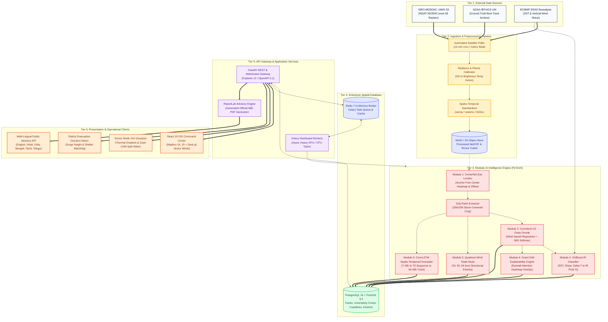
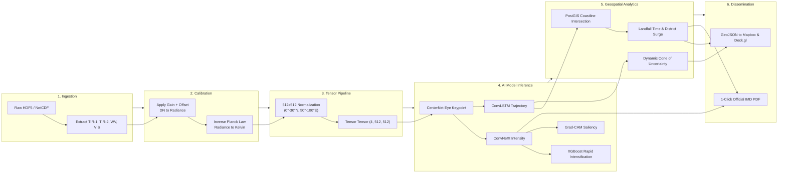

# 06 HLD: High-Level Design

## 1. Executive System Architecture

The **CycloneAI / DeepCyclone** platform is designed as an asynchronous, event-driven, multi-tier geospatial deep learning platform. It couples near-real-time satellite observation ingestion with multi-model PyTorch inference, PostGIS spatial queries, and an interactive GIS decision-support command center.

---

## 2. End-to-End Ingestion & Processing Data Flow

---

## 3. Subsystem Component Responsibilities

| Subsystem | Primary Technologies | Core Responsibilities |
|---|---|---|
| **External Ingestion** | AWS S3 SDK, MOSDAC Scraper, ECMWF API | Polls 15-minute geostationary satellite feeds, checks file integrity via SHA-256 checksums, ingests ERA5 environmental reanalysis variables (SST and Vertical Wind Shear). |
| **Calibration & Prep** | `xarray`, `netCDF4`, `rasterio`, `NumPy` | Converts raw integer Digital Numbers (DN) to spectral radiance using sensor gain/offset; converts thermal radiances to Brightness Temperature in Kelvin via Inverse Planck Function; stacks 4 spectral bands into a uniform `(4, 512, 512)` floating-point tensor. |
| **AI Inference Cluster** | `PyTorch 2.3+`, `timm`, `CUDA 12.x`, `XGBoost` | Performs anchor-free eye center localization (CenterNet); crops storm-centered `(4, 256, 256)` patch; predicts continuous Maximum Sustained Wind Speed (knots) and IMD category (ConvNeXt-V2); projects multi-step future track coordinates (ConvLSTM); classifies 24-hour Rapid Intensification probability (XGBoost); and computes backward gradients for Grad-CAM explainability. |
| **Spatial Database** | `PostgreSQL 16`, `PostGIS 3.4` | Persists historical tracks, real-time storm fixes, multi-timestep forecast coordinates, dynamic Cone of Uncertainty polygons, coastal bathymetry profiles, and district census demographics; executes sub-10ms spatial intersection queries (`ST_Intersects`, `ST_Distance`). |
| **Asynchronous Task Hub** | `Celery`, `Redis 7` | Decouples HTTP request/response loops from heavy matrix operations; coordinates ingestion, preprocessing, GPU inference, and report publishing queues without blocking client connections. |
| **API & Gateway** | `FastAPI`, `Pydantic v2`, `Uvicorn` | Exposes secure REST endpoints, validates payload schemas, streams live WebSocket telemetry, and coordinates microservice communication under strict sub-second SLA constraints. |
| **Interactive Client** | `React 19`, `Mapbox GL JS`, `Deck.gl`, `Tailwind CSS` | Renders interactive multi-layer GIS maps with animated wind particle vectors, cone polygons, live telemetry gauges, side-by-side Doctor Mode Grad-CAM overlays, and district evacuation risk tables. |
| **Dissemination Engine** | `ReportLab`, Multi-Lingual Text Templates | Compiles real-time model outputs into standardized official IMD National Cyclone Warning Centre advisory bulletins (PDF); translates emergency instructions into regional coastal languages (Hindi, Odia, Bengali, Tamil, Telugu). |

---

## 4. Non-Functional Requirements & Architectural Constraints

- **Sub-Second Latency:** Complete pipeline inference (Eye Detection + ConvNeXt Intensity + ConvLSTM Track + Grad-CAM) completes in under **4.0 seconds** on a single NVIDIA GPU instance (or under 1.5 seconds via ONNX Runtime).
- **High Availability & Fault Tolerance:** If primary infrared channels suffer corrupted scan lines, the preprocessing pipeline raises a data quality warning and falls back to secondary split-window channels (TIR-2) and climatological persistence extrapolation.
- **Zero-Execution Sandbox:** Ingested satellite raster files (`.h5`, `.nc`) are opened strictly using read-only numerical array parsers (`xarray`/`h5py`) without evaluating executable macros or embedded scripts.
- **Standardized Interoperability:** All spatial features (tracks, cones, gale radii) conform strictly to OGC GeoJSON standards and EPSG:4326 (WGS 84) coordinate reference systems for seamless interoperability with government GIS systems.

