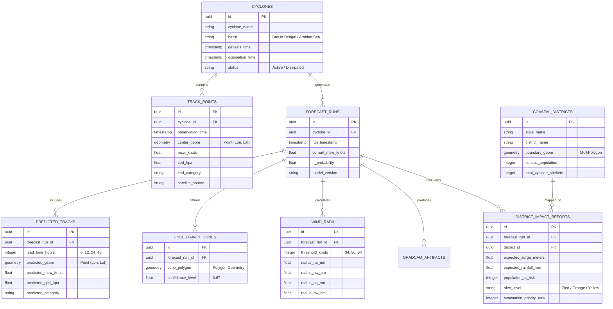

# 07 Database Data Design

## Database / Data Design Strategy

PostgreSQL with the **PostGIS** spatial extension is the core relational store. Spatial indexing (`GIST`) is applied across all coordinate points, track lines, and cone polygons to ensure sub-millisecond query execution.

---

## Core Data Assets & Schema

