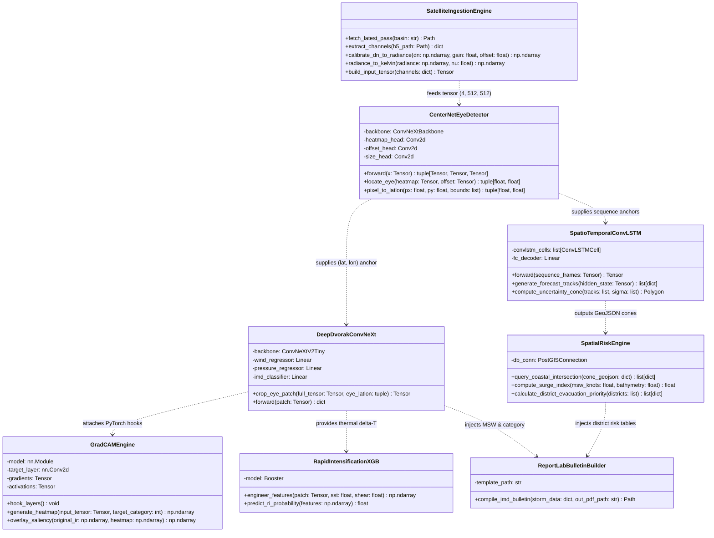
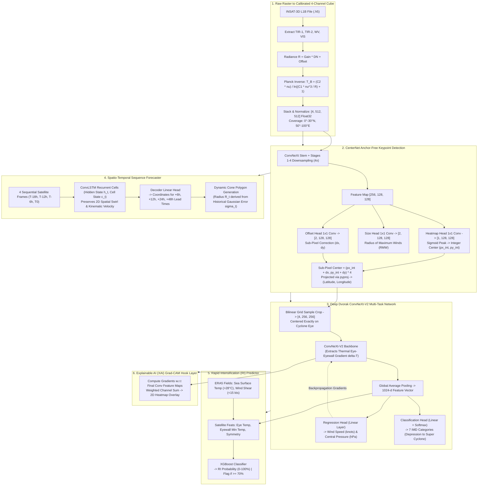
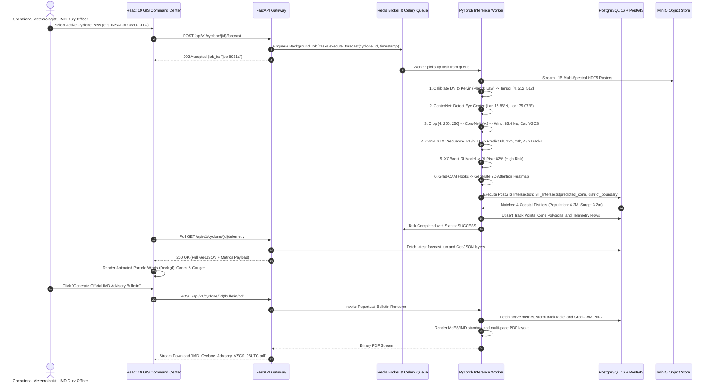

# 09 LLD: Low-Level Design

## 1. Directory Structure

```
cyclone-platform/
├── docs/                      # PRD, TRD, HLD, LLD, and meteorological validation docs
├── ai_engine/                 # Python PyTorch & Deep Learning Microservice
│   ├── ingestion/
│   │   ├── satellite_downloader.py # AWS S3 and MOSDAC automated scraper
│   │   ├── netcdf_processor.py     # Satellite radiance unpacking & calibration
│   │   └── tensor_builder.py       # Multi-channel tensor normalization & cropping
│   ├── models/
│   │   ├── eye_detector.py         # CenterNet keypoint center localization
│   │   ├── deep_dvorak.py          # ConvNeXt-V2 intensity and wind estimator
│   │   ├── track_convlstm.py       # Spatio-temporal ConvLSTM sequence model
│   │   └── ri_xgboost.py           # Rapid intensification tabular classifier
│   ├── xai/
│   │   └── gradcam_engine.py       # PyTorch layer gradient extractor for attention maps
│   ├── evaluation/
│   │   ├── track_error.py          # Mean Absolute Track Error calculator
│   │   ├── intensity_metrics.py    # Wind MAE and category classification metrics
│   │   └── ri_benchmark.py         # F1-score & accuracy for RI events
│   ├── reports/
│   │   └── bulletin_pdf.py         # ReportLab IMD-compliant PDF generator
│   ├── schemas/
│   │   └── telemetry.py            # Pydantic v2 schemas for API contracts
│   ├── main.py                     # FastAPI REST routes and Celery task hooks
│   └── tests/                      # Pytest test fixtures and validation scripts
├── backend/                   # Node/Express API Gateway & Auth
│   ├── routes/cyclone.js
│   ├── services/db.js              # PostGIS client connection
│   └── middleware/auth.js
├── frontend/                  # React 19 Interactive GIS Client
│   └── src/
│       ├── components/
│       │   ├── MapViewer.jsx       # Mapbox GL JS map with cone & track layers
│       │   ├── WindParticles.jsx   # Deck.gl animated wind particle overlay
│       │   ├── TelemetryCard.jsx   # Live intensity, MSW, and pressure gauges
│       │   ├── DoctorMode.jsx      # Side-by-side Grad-CAM inspector
│       │   ├── ImpactTable.jsx     # District vulnerability & evacuation matrix
│       │   └── BulletinModal.jsx   # PDF preview and multi-lingual alerts
│       └── services/api.js
└── docker-compose.yml
```

---

## 2. Low-Level Class & Component Architecture



---

## 3. Deep Learning Tensor Processing Pipeline (LLD)



---

## 4. End-to-End Operational Sequence Flow



---

## 5. Tensor Interface Contracts & Data Specifications

### CenterNet Input & Output Signatures
```python
# Input Tensor
input_tensor: torch.Tensor  # Shape: (B, 4, 512, 512), dtype=torch.float32
# Channels: [0: TIR-1 (Kelvin), 1: TIR-2 (Kelvin), 2: Water Vapor, 3: Visible]

# Output Tuples
heatmap: torch.Tensor       # Shape: (B, 1, 128, 128), range: [0.0, 1.0] (Sigmoid)
offset:  torch.Tensor       # Shape: (B, 2, 128, 128), range: [-0.5, 0.5] (dx, dy)
size:    torch.Tensor       # Shape: (B, 2, 128, 128), range: [0, max_rmw_pixels]
```

### Deep Dvorak ConvNeXt-V2 Signatures
```python
# Cropped Eye Patch Input
eye_patch: torch.Tensor     # Shape: (B, 4, 256, 256), centered on (center_x, center_y)

# Output Multi-Task Dictionary
output = {
    "msw_knots": torch.Tensor,       # Shape: (B, 1), Continuous wind speed estimate
    "pressure_hpa": torch.Tensor,    # Shape: (B, 1), Central pressure deficit estimate
    "category_logits": torch.Tensor, # Shape: (B, 7), Raw logits for 7 IMD categories
    "feature_embedding": torch.Tensor# Shape: (B, 1024), Dense latent storm representation
}
```

### ConvLSTM Sequence Input Signatures
```python
# 4-Frame Temporal History Input
sequence_tensor: torch.Tensor # Shape: (B, 4, 4, 256, 256)
# Dimensions: (Batch, Timesteps=4, Channels=4, Height=256, Width=256)

# Output Multi-Step Coordinates
predicted_track: torch.Tensor # Shape: (B, 4, 2)
# Predictions for lead times: [+6h, +12h, +24h, +48h] in (Lat, Lon)
```

