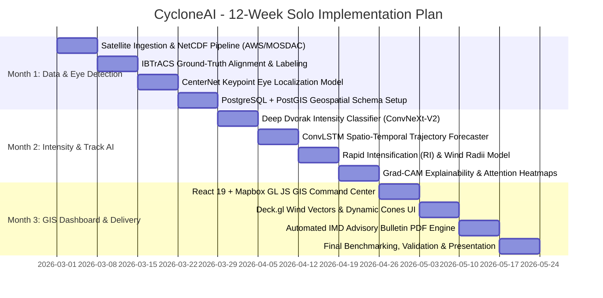

# 17 12-Week Roadmap (Solo Developer Plan)

---

## Phase Milestones
- **Weeks 1–4 (Data Engineering & Center Detection):** Download and calibrate INSAT-3D + NOAA IBTrACS data; build CenterNet eye keypoint detection model; configure PostGIS spatial tables.
- **Weeks 5–8 (Core AI & Modeling):** Train ConvNeXt-V2 Deep Dvorak intensity model; build ConvLSTM 48-hour trajectory sequence forecaster; train XGBoost RI model; integrate Grad-CAM explainability.
- **Weeks 9–12 (Full-Stack System & Dissemination):** Build React 19 + Mapbox GIS command center; implement Deck.gl wind particles; create ReportLab 1-click IMD bulletin export; complete benchmark validation and defense presentation.
